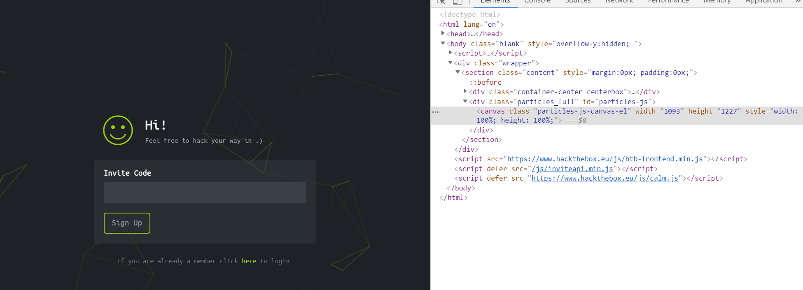
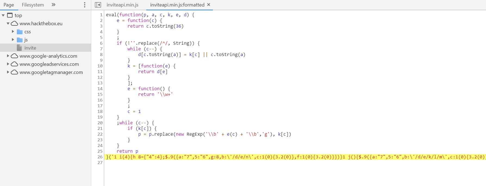
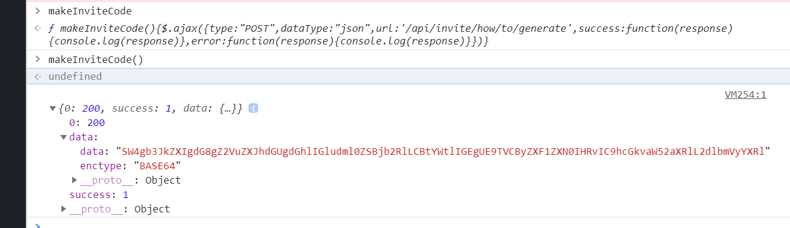
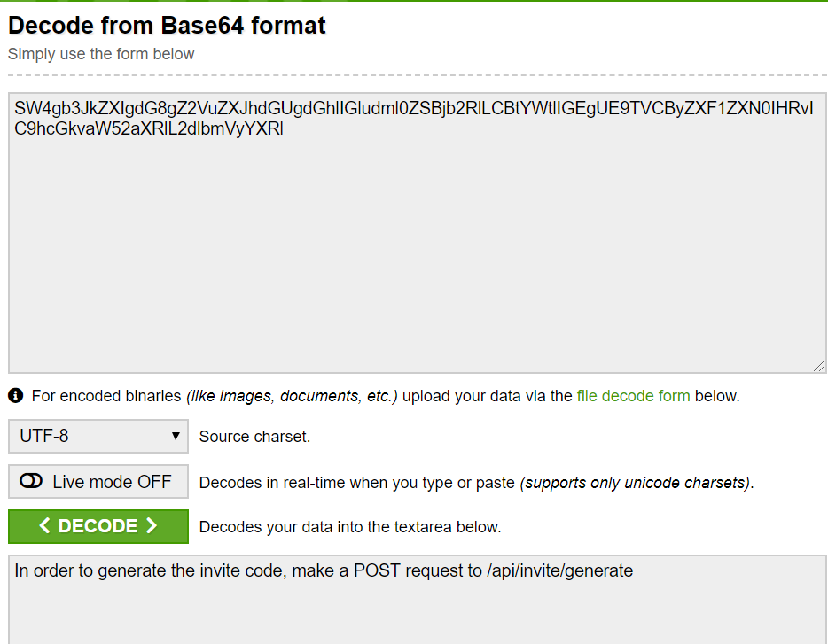
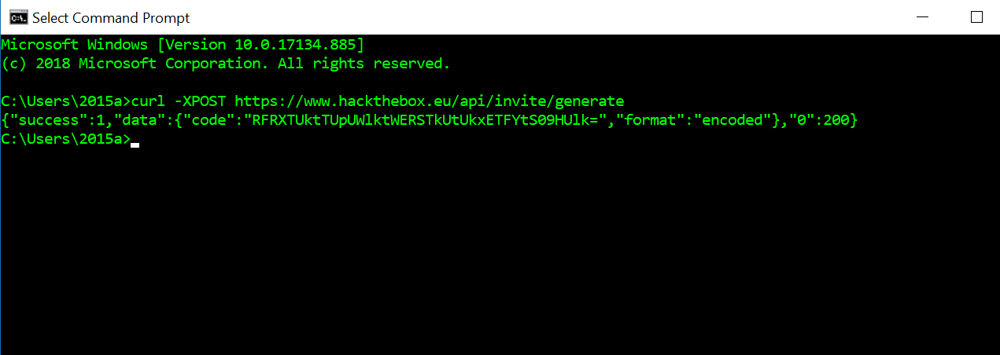
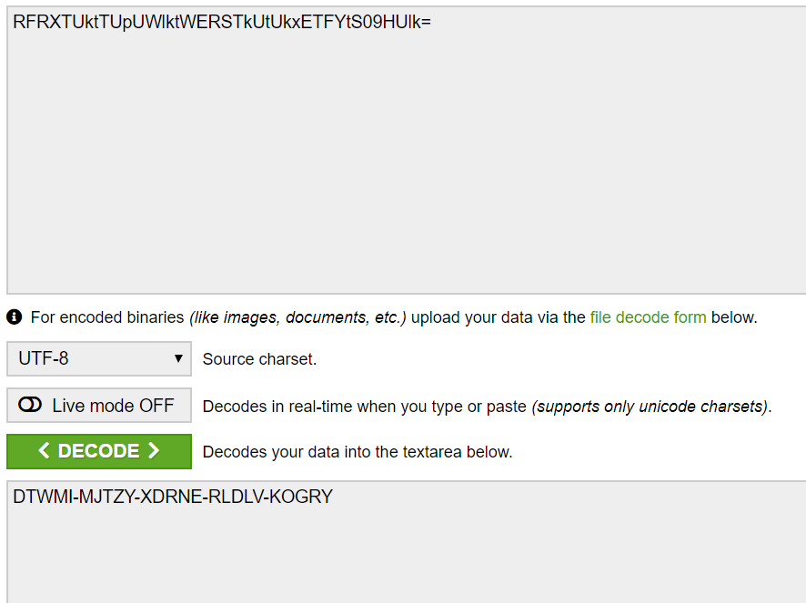
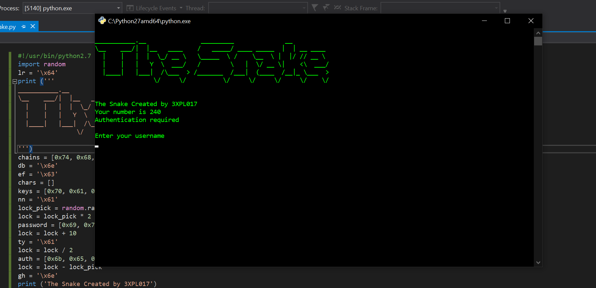
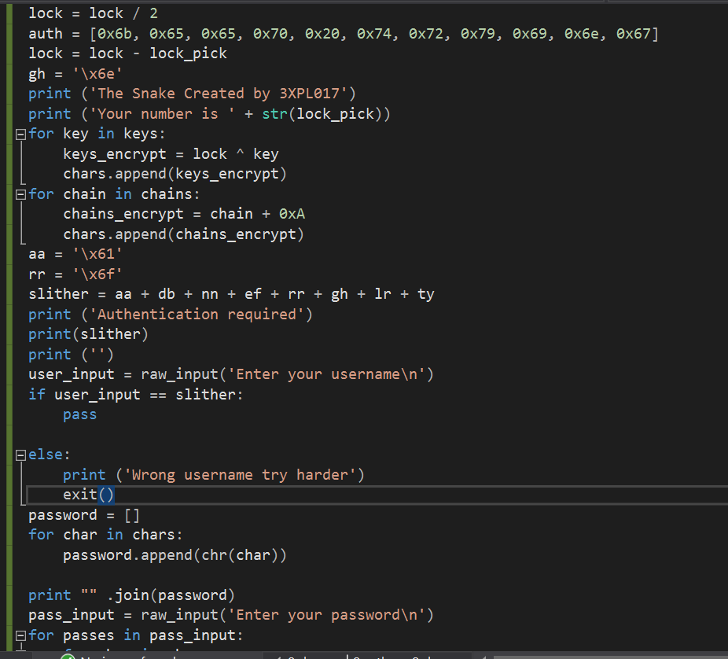
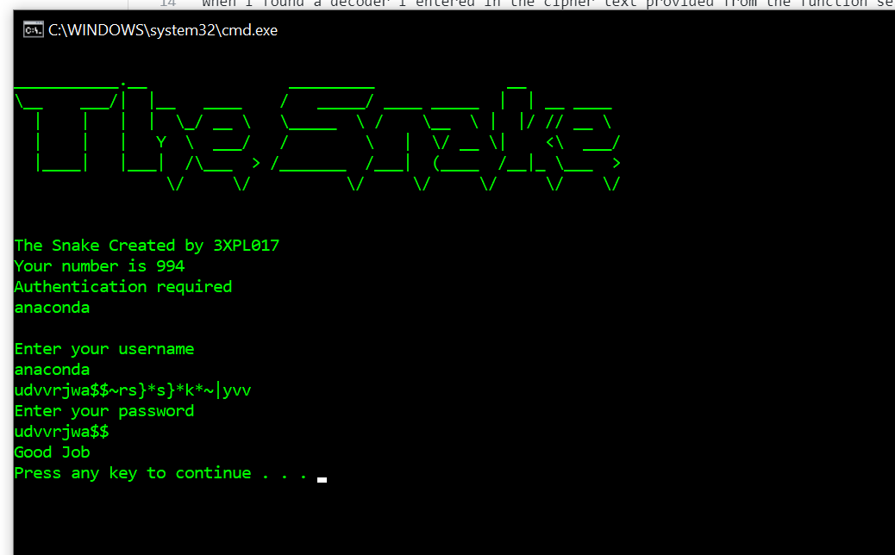
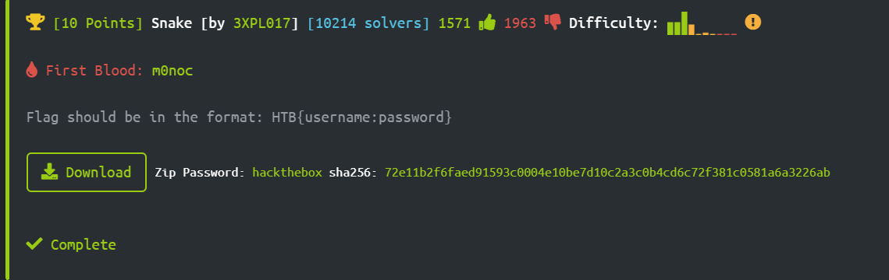

# Final Write-Up Hack The Box
--------------------------------------------------------------------

## Obtaining an Account
After reaching the invite page I immediately examined the web page through the inspector tools providing by Google Chrome to see if any scripts were running in the background that could link to a invite code generator or hint at one. Within the inspector was a inviteapi.min.js script which caught my attention. I then opened up the file in the sources tab to insepct the code where there was a defined function called makeInviteCode that could be run within the Javascript console provided by Chrome. 

Knowing that the funciton could be ran I made call to it within Chrome using the built in console to see what output would be provided as a result. After running the result contain encrypted text which was encrypted using Base64 encoding scheme. Knowing the encryption scheme I copied the provided data and went looking for a text decoder that has Base64 as an option. 

When I found a decoder I entered in the cipher text provided from the function set to decode from Base64 and let the decoder do its work. After being decoded the message stated 'In order to generate the invite code, make a POST request to /api/invite/generate'.

I then made a POST request following the format suggested by the cipher text and was provided the result below.

With the newly provided cipher text from the API used by 'hack the box' I returned to the decoder and decoded the cipher text from the API which in return gave me the generated invite code for the website. 

After entering my code I was able to register an account with 'Hack the Box' and continued to the challenges!

## First Challenge, Topic= Reverse, Name= Snake (10 pts)
Since I had no idea where to start I chose the first file which dealt with reversing challenges. I then chose the easiest listed challenge available so that I could get a feel for what the challenges in 'Hack the Box' would be like. Looking at the provided files I ran the python script in visual studio 2019 to see how the application ran. On run a prompt showed up as seen here:

I then looked at the source code and saw that the inputs were being compared to two different variables one called 'slither' for user name comparisona and 'pass_input' for comparison with the password. Seeing the comparisons I looked at what information was being used to fill both viariables which were each filled with pre-determined string characters. This lead me to believe that before each prompt I could simply print the username and password necessary to complete the challenge. 

Low and behold it worked! with the username and password printed I was able to complete the challenge since I need the usernamen and the first ten characters of the password to pass the flag input for the challenge. Taking in the known parameters I passed in the flag with corresponding syntax and passed the challenge.

