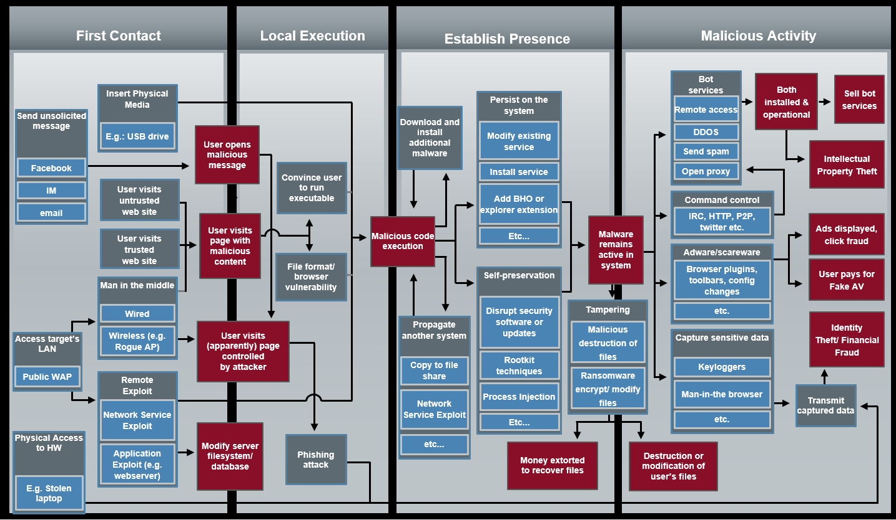
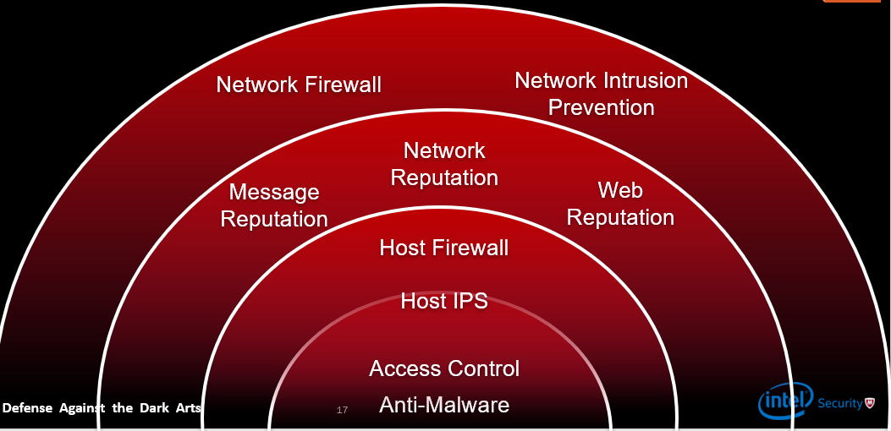

## Week 3 Write-Up
Week 3 provided an introduction of malware defense presented by Craig Schmugar a security speicalist at McAfee. Material for the week consisted of malware first contact, detection, defensive tactics dependent on attack vector, signature analysis, and attack flows. Included in the material was a lab which utilized Yara which itself provides a rule-based approach to create descriptions of malware families based on textual or binary patterns. We also were introduced to the Cuckoo malware analysis tool which is used to create a sandbox for executing malicious files to study and understand malware. Following I will discuss in detail the material that was covered in week 3. 

### Malware Procedure 
Starting off the presentation was the overview of the steps malware takes to infect a desired host and/or system. Understanding the procedure is a building block in defense as providing the best defensive practices requires having knowledge on both sides of the playing field. General malware behavior steps are depicted in the diagram seen below (image provided by Craig Schmugar):

 

#### Malware Procedure Steps
1. First Contact - The medium or style of interaction utilized by the attacker to gain attention of a user so that the user will interact with the malicious software that is being presented which in cases can be through email, instant messaging, malvertising, poisoned search results, and physical access to a system. 

2. Local Execution - After establishing contact with the user local execution is acquired by the running unknowingly run an executable through a button or applicaiton. Local execution can also happen through browser exploitation via browser-based exploit kits or abusing features that are known on various software applications or even operating systems.

3. Establish Presence - Following execution the malware will then begin to establish itself on the victim machine or system that interacted with it. Common malware presence tactics consist of utilizing operating system like file names or path schemes, adjusting time stamps to appear legitimate, or using signed binaries. Malware can use the previously common strategies through kits developed for malware for an automated process to hide from the user. When the malware has a desired presence it will then develop a persistent state within its desired host so that it can continue its behavior during a system startup, operating system startup, application startup, or other scheduled tasks without having to run execution again to establish another presence. 

4. Malicious Activity - The goal for the malware through the entire process was to reach this step in its behavior where it now begins to either search for sensitive information on the infected host or utilize the infected host to run processes or even use the host as another machine within a botnet/bot services. Some specific activity consists of an infected system being used to send spam, remote access onto other hosts, help with DDOS attacks, support adware/scareware/malvertising leading to user paying for advertising fees, and user sensitive activity such as a keylogger along with others. 

### Malware Defense Practices
Due to the dangers and constant rise of malware there have been a number of popular practices and technologies developed to help secure systems or prevent/minimize damage from malware. One of the most popular practices is establishing a network firewall developed around policies and security rules so that machines within a local network are protected from malware located on on outside newtorks (usually the internet). A second common practice is evaluating message/network/web repuation among various software packages, providers, and systems so that you can utilize those products which have a high reputation among other users or companies. On the user level you can establish a host firewall which controls and limits various network traffic to a specific machine as well as integrate access control along with anti-malware for host scanning and prevention of malware behavior. A diagram that sums up these practices can be seen below depicting a network to user/machine level prevention practices. 

 

