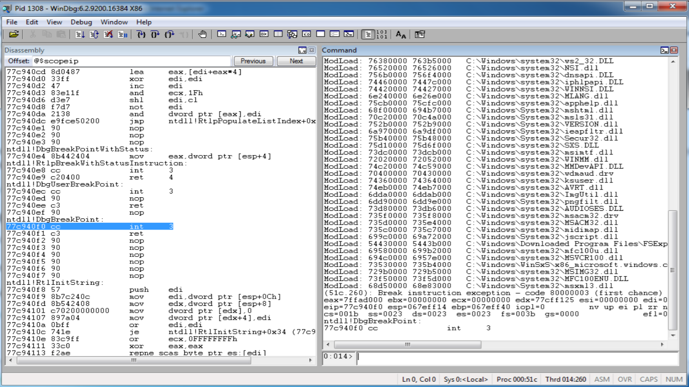

## Week 4 Write-Up
Week four focused on content provided by Brad Anton. The lecture consisted of hacking trends in the industry, exploits, using WinDBG as well as stack/heap overflows. Content for week 4 introduced the contextual growth of hacking along with the rising trends that are increasing based on software implementation in the industry and how those weaknesses (some discussed in lecture content) can be exploited for both good (ex. bug bounties) or for personal gain.

### Hacking in Layman Terms
One of the standpoints provided by Brad Anton was that hacking, in simple terms, is just manipulating code in a manner the leads to unplanned behavior or an individual taking advantage of the behavior/misconfiguration. Brads viewpoint to me was a great way to start since most of the time in the field of computer science we can get so caught up in the details of our work that this viewpoint really brings us back to the simplicity of what we are doing, however, its how it is done that introduces the complexities that are seen now. I also enjoyed the evolution of hacking from Brad's perspective of hacking and how it has evolved into a much more serious topic over time as both hardware and software developed. Brad states that in the early days hacking was a relaxed hobby where many enthusiasts simply messed with systems as a way to learn rather than most days where hackers have become infamous for utilizing system weaknesses for some form of personal gain. The introduction was a great way to really breakdown the simplicity of what we are doing and how such a topic can grow from a small hobby to a very serious aspect of every day life since software has been integrated into so many activities of our life. 

### WinDBG 
Following the simple layout of concepts was the introduction of WinDBG (pronounced win-debug) which is a multi-purpose debugger provided by Microsoft for the Microsoft Windows operating system.  Use cases of WinDBG consist of debugging user mode applications, device drivers, and the operating system itself in kernel mode. unlike some other debuggers such as GDB (GNU Debugger) WinDBG provides a graphical user interface to provide usability to its target users. Popular applications of WinDBG is analysis of memory dumps during a crash of the applications listed in the common use cases of WinDBG. Analyzing an application that has crashed is the main goal in using WinDBG as reaching a crash point in an application leads us to the expectation that we have reached some point of unexpected behavior or perhaps bad practice that has led to poor configuration. WinDBG thus allows us to step through the program using a command line (with various commands) within the GUI (graphical user interface) to dump values within registers, step through lines of execution, view opcodes/operands, and much more. WinDBG also includes the use of extensions that have been developed to help users in analyses by implementing features helpful in dissecting common use cases among core users. Below is the WinDBG GUI and some useful commands within the command line interface:

 

- View Memory: du, da, dd
- Stepping: t, p
- Breakpoint: bp (some address)
- Address: !address
- Help/List Commands: .help 
- Attach Process: .attach
- Math: ?(some expression)
- Process: !peb
- Thread: !teb 

### WinDBG Lab

### Understanding at a Lower Level
Getting introduced to WinDBG provided us the knowledge that analyses of broken/crashed systems occurs at a very low level of the system most commonly assembly language correlating to a specific application or system. 
