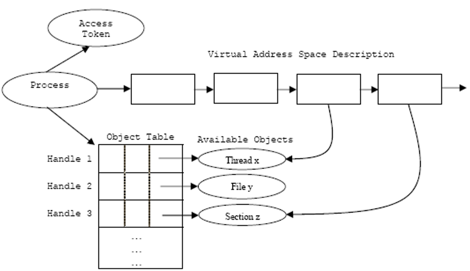

## Week 5 Write-Up
Week four focused on content provided by Aditya Kapoor, a research architect at McAfee Labs. The lecture this week provided a brief overview of Windows operating system internals and the development as well as implementation of rootkits. Content for week 5 introduced how the Windows kernel and user ineract, kernel memory, Windows threads, Windows processes, and Rootkit styles plus various techniques utilized. 

### Kernel v. User
One of the first concepts discussed was the interaction between the operating system kernel and the end user. At the top layer is of the interaction is applications which are compiled to executables or dll's that interact with the Windows operating system API which will then interact with either user-mode drivers or the operating system kernel iteself. knowing this top level is very important as it shows the interaction to utilized the systems kernel for system calls which if accessed from outside can lead to detrimental security issues. Furthermore after receiving the API information or exported driver information (from user-mode) the kernel will then interact with the abstract hardware layer which will use the kernel's information to utilize subroutines built for specific hardware so that when interacting directly with the hardware the hardware itself can perform the necessary computation or system routine designated by the user or application that came in contact through the Windows API or exported drivers. Below is a diagram of the interaction between users/applications and an operating system's kernel (image provided by Aditya Kapoor).

### Kernel Memory
Kernel's within an operating system are designated as flat memory which means that a kernel can access physical memory contiguously within the system it is in. Kernel drivers will also have access to the same memory as the kernel itself therefore making kernel level permissions the main target for attackers whom of which will create harmful applications/executables to users so that they can be granted the necessary permissions. Since kernel's have access to physical memory they also have access to defined structures for a system such as system service descriptor table (SSDT), interrupt descriptor table (IDT), I/O request packets (IRP), and other structures. Having access to these structures is necessary for system operation, however, should an attacker gain access to these structures they can be utilized as a tool for stealth for rootkits. 

### Agony Lab

### Threads in Windows
A thread is the basic unit to which the operating system allocates processor time. A thread can execute any part of the process code (smallest 'unit' that can execute code), including parts currently being executed by another thread and due to the increase in CPU processing many applications today are multithreaded allowing for mutliple computations to be happening simultaneously on your machine. Vital thread components include thread context, thread stack, thread environment block, thread scheduling, and thread to process relationships. From the previous components is a thread object that defines threads, from a thread object is a kernel object which is a structure defined by the host operating system to describe various operating system constructs. In further detail of thread components, a thread context will store all related register values of a thread during system execution/halts. A thread stack is a very familiar data structure as it just references that each thread has its own stack broken into a user stack (used for thread’s function calls and local variables) and a kernel stack (used when control is transferred from user to kernel plus data is copied for security). The thread environment block is a data structure in Win32 on x86 that stores information about the currently running thread. Thread scheduling which refers to the priority or schedule implementation for threads waiting for execution. Finally, thread to process relationship which references the relationship of a thread of execution and its contribution to the process that it is defined within (image below provided by Aditya Kapoor).

### System Boot Process and Processes in Windows
The system boot process within an operating system in initialized at pre-boot by which begins diagnostics on memory of a system as well as other hardware components necessary for functionality. The BIOS is then loaded which will locate and execute the Master Boot Record in the machines boot device. On execution the Master Boot Record locates the active partition storing the boot sector for execution so that the boot selector loads NTLDR from the disk to load the operating system and continue initialization. Regular processes within Windows are implemented as objects which if executable can contain one or more threads (one thread is needed for execution). A process also includes an object table that has handles to other objects known to this process (image below provided by Aditya Kapoor). 

### Rootkits and Rootkit Methods
By definition a rootkit is malware that actively conceals its existence and actions from users and system processes (about ten percent of malware use a rootkit). Rootkits are most prevalent in the 32 bit version of the Windows operating system, however, there are some rootkit families that exist for the 64 bit version of the Windows operating system. One of the major learning points of rootkits is the extensive amount of knowledge you will learn about kernel security implementation and challenges. Going back to a previous statement, the reason rootkits are not as prevalent on 64 bit operating systems is that 64 bit systems are harder to enter at the kernel level. Rootkits methodologies for infiltrating 64 bit systems consist of bypassing driver signing check, modifying the windows boot path (secure boot prevents this), kernel/third party driver exploits, and stealing valid digsigs. Rootkits also have common stealth trends amongst each other which consist of file forging, memory forging, self-protection, attacking AV (anti-virus), disassociating memory from file-on-disk, removing dependency on files, and untrusting the trusted (broken down in the list). File forgin consists of overwriting existing files and forge the ‘view’ such that AV gets the clean view instead of malicious. Disassociating memory from file-on-disk consists of the rootkit memory giving away its associated file on the disk which is a problem for analysts since it is difficult to track kernel memory. Removing dependencies on files consist of scanners based on direct file-system parsers that work well so there is no file in the FS which helps rootkits move malicious code to boot process, move malicious code to the bios, or move encrypted malicious code to raw sectors or as a file. Rootkit self-defense consists of defending components through watcher threads (monitor/protect hooks), handling attacks from the kernel, and identifying AV's by behavior then untrusting them.  
 

