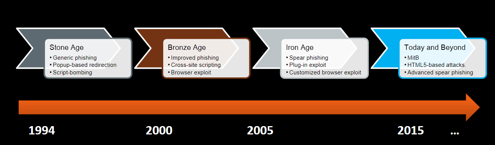

## Week 7 Write-Up
Week 7 focused on a general overview of web security whose content was provided by Cedric Cochin of McAfee Labs. Week 7's content consisted of basic Web fundamentals, the web as a threat delivery mechanism, web attack vectors plus common defenses, web as a threat delivery mechanism, anatomy of the modern user agent, and web security research tools. Content from week 7 is great at it truly shows a resource that by many can be taken for granted and the numerous dangers that can be presented in a tool that is widely used. 

### Oregon Law: Computer Crime 
On introduciton Cedrich immediately moved to defining what is a computer crime under Oregon state law. The definitions is as follows:

1. Knowingly accessing or using a computer or network (or attempting to do so) for the purpose of fraud; to obtain money, property, or services; or to commit theft of proprietary information.

2. Knowingly and without authorization altering, destroying, or damaging any computer, network, software, data, etc. (or attempting to do so).

3. Knowingly and without authorization using or accessing a computer or network (or attempting to do so).

- While the first two offenses may be charged as a Class C felony, the third offense is charged as a Class A misdemeanor. Conviction on either charge may result in a prison sentence, as much as one year for a Class A misdemeanor and as much as five years for a Class C felony.

Having knowledge of this definition is key as while developing web applications or attempting to exposing them does have consequences on various levels of extremity. Many malicious users fail to really recognize this when attempting to inject malware via some mechanism and when the law eventually strikes they could be unprepared. Seeing the development of law for software is also great as we know just how powerful software is since it is so strongly integrated into our lives that establishing some ground rules in necessary. 

### Evolution of the Web and Web-Based Delivery
Following the discussion of how the law has become established in the realm of software the discussion moved on to how the web has developed over time with a basis being set that HTTP (Hyper-Text Transfer Protocol) is the foundation of data communication for the web. Key components of the web consist of content, search engines, browsers, world wide web, Internet, networks, and computers. Having knowledge of these components is vital in the world of web security as various exploits can be attempted through various platforms and as technology develops so will the layers of the web allowing for new techniques or attempts to be introduced. The past concept can be seen in what are defined as the different ages of the web which can be seen in the following image (image provided by Cedric Cochin):

With such a wide use and an array of components the web is utilized to deliver ninety five percent of all malware developed therefore making this topic very relevant in modern industry and even within the lives of daily users whom of which are not in the industry itself. One of the next big steps in the web was the development of Javascript into the poweful language it has become today (especially in development of the web). With the integration of Javascript the web exprienced progress in the web browser component we have seen stronger web experiences however with that same integration there are even more injection points for malware to introduce itself. Common injection points are de-obfuscated content (browser/extensions), Javascript (script engine), raw html (WinInet, ETW/ETL), and HTTP proxy network layer. While the content for this section was very brief it should provide the standpoint that technology in the web is rapidly and constantly changing plus developing leading to constant changes from a network perspective therefore it is vital to stay up on modern technologies. 

### User-Level Attacks
User-level attacks in the context of web security are relative to the content provided to the user or tactics that manipulate the end user to either load the malware themselves or lead them to an endpoint that can enforce the malware automatically. Due to such high susceptibility on the user end, social engineering has become the prime platform for injecting malware to other machines/systems since it is the user who can still be tricked and give instant access to desired resources. A definition provided by Cedric on social engineering states "In the context of information security, refers to psychological manipulation of people into performing actions or divulging confidential information. A type of confidence trick for the purpose of information gathering, fraud, or system access, it differs from a traditional "con" in that it is often one of many steps in a more complex fraud scheme". Since users are the weak link in the network of interaction numerous methods such as phishing, SEO poisoning, fake AV's, social media link insertion, forum link insertion, and malvertising have been developing to utilize social engineering to deliver their intended malware.  
