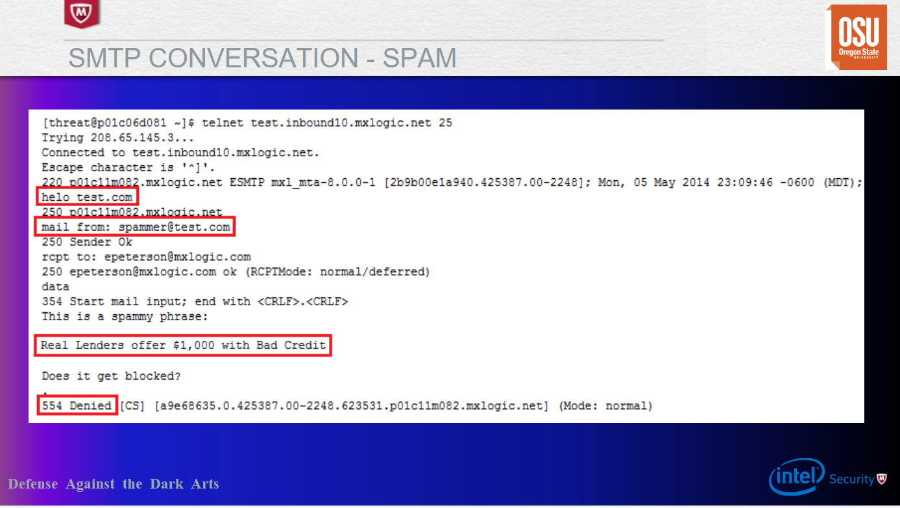
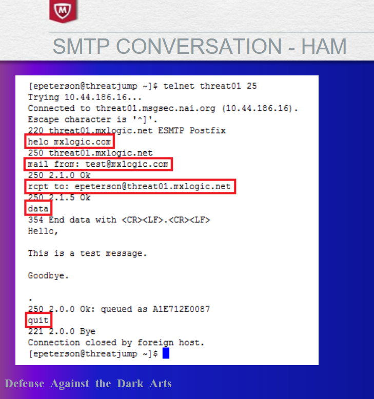

## Week 8 Write-Up
Week 8 focused on message security which was presented by Eric Peterson who is a research manager at McAfee Labs. Content for week 8 consisted of a brief overview of anti-spam/spam history, terminology, industry-standard technology/applications, and implementations of social engineering in spam/phishing.

### The Phishing Quiz
After his introdcution Eric began is lecture with a neat quiz developed by McAfee that was used to test other users and their capabilities to evaluate emails or messages to determine if they are legitimate or spam/phishing attempts. I really enjoyed the quiz that Eric and the McAfee provided as the questions and messages provided showed how difficult it can be to determine if a message is legitimate or spam as well as methods that can be used across devices such as checking the URL, domain that will be directed to, literature evaluation, and so on. While mostly being successful in the quiz the lesson learned is while we may be good at evaluating most spam/phishing all it takes is once to completely expose your own machine or system that you are associated with. 

### Terminology
Following the phishing quiz Eric then introduced a variety of terminology we should note when dealing with message security and for future discussion in the lecture. Here is the terminology Eric introduced us to:

- Spam: unsolicited junk email sent indiscriminately in bulk, often for commercial purposes. Much of it is sent by botnets, networks of virus-infected computers, complicating the process of tracking down the spammers. Most email today is actually spam. Below is an example of spam provided by Eric. 

- Ham: the complete opposite of spam, ham is legitimate messages sent to a user or machine or messages that is desired by a user or machine. These messages should not be classified as spam by spam engines/evaluators. Below is an example of ham provided by Eric.

- Spamtrap/Honeypot: A spamtrap is a honeypot used to collect spam. Spamtraps are usually e-mail addresses that are created not for communication, but rather to lure spam. Honeypot can be used to name the same type of trap as well since a spamtrap is a type of honeypot.In order to prevent legitimate email from being invited, the e-mail address will typically only be published in a location hidden from view such that an automated e-mail address harvester (used by spammers) can find the email address.

- Botnet: A botnet is a number of Internet-connected devices, each of which is running one or more bots. Botnets can be used to perform distributed denial-of-service attack, steal data, send spam, and allows the attacker to access the device and its connection. The owner can control the botnet using command and control software.

- Snowshoe Spam: a strategy in which spam is propagated over several domains and IP addresses to weaken reputation metrics and avoid filters. The increasing number of IP addresses makes recognizing and capturing spam difficult, which means that a certain amount of spam reaches their destination email inboxes.

- Phishing: Fraudulent attempt to obtain sensitive information such as usernames, passwords and credit card details by disguising oneself as a trustworthy entity in an electronic communication.Typically carried out by email spoofing or instant messaging which with user interaction will redirect to a malicious site or force a download to allow the attacker to gather sensitive data. 

- Spear Phishing: similar to phishing, however, spear phishing involves interacting with a targeted individual to gain personal or other confidential information. 

- 

